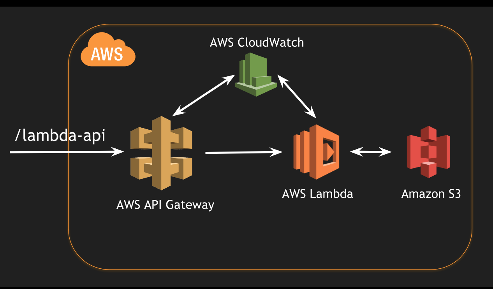

# AWS Lambda Java API Example

This example code is used for running a Java Lambda using API Gateway trigger. 

It uses AWS Lambda Core SDK for `RequestHandler` implementation which is called by the trigger

## Architecture Used

